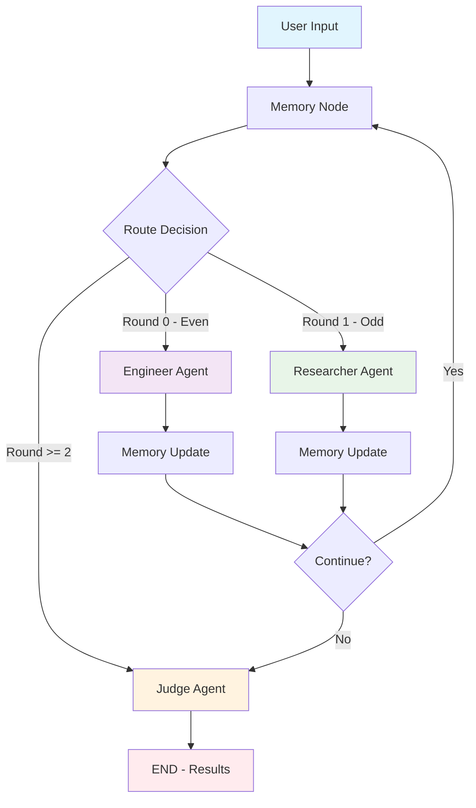
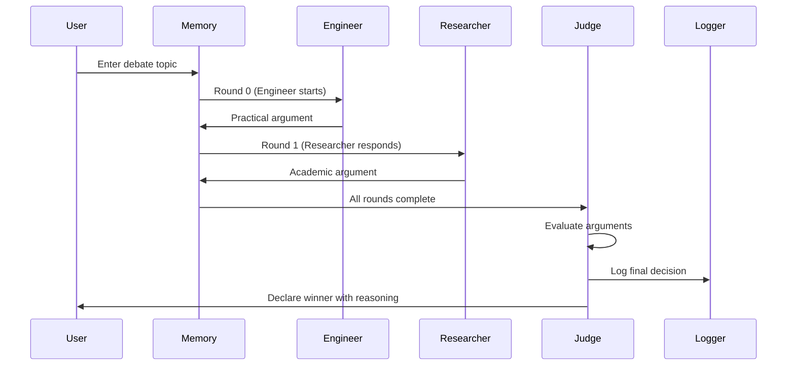
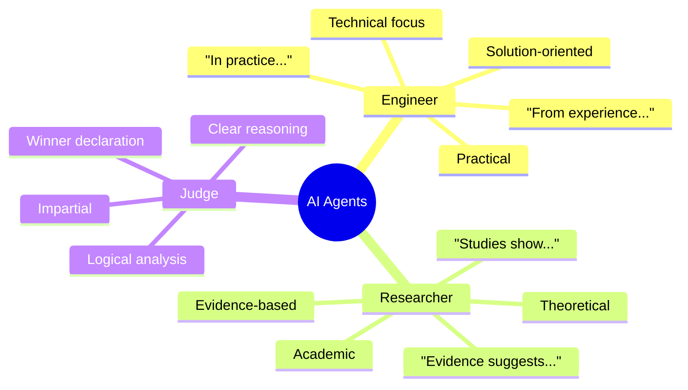
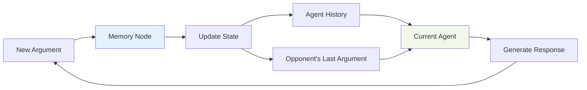
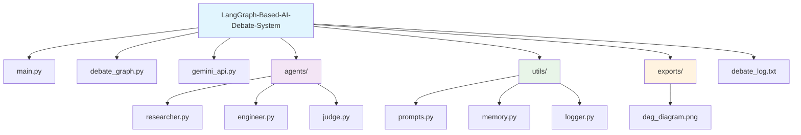
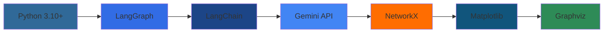
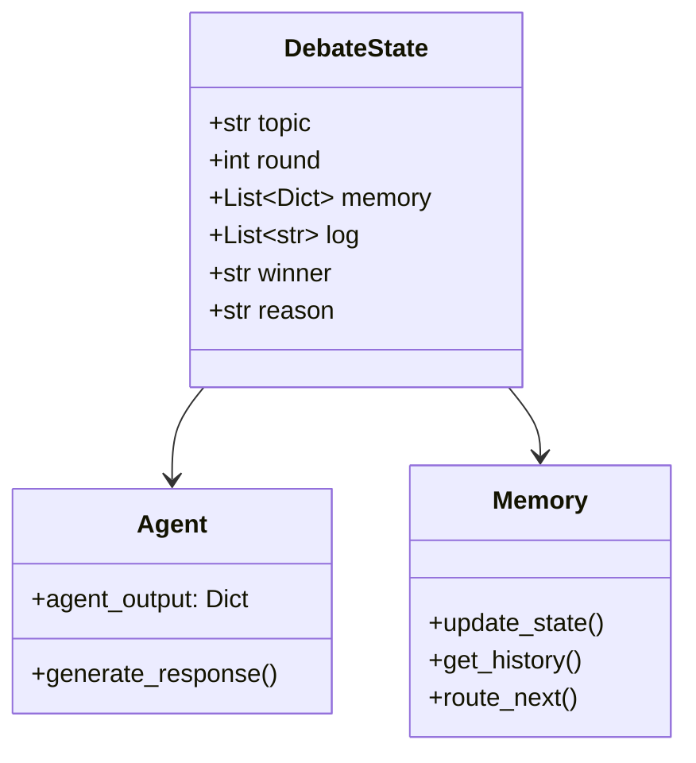
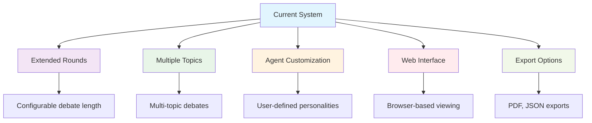

# LangGraph-Based AI Debate System

A sophisticated command-line AI debate system built with LangGraph that orchestrates structured debates between two specialized AI agents: a Researcher and an Engineer. The system manages memory, enforces turn-taking, and provides impartial judgment using Google's Gemini API.

## 🎯 Project Overview

This system creates engaging debates by having two AI agents with distinct personalities argue different perspectives on user-provided topics. The debate follows a structured 2-round format with memory management and concludes with an AI judge evaluating the arguments.

## 🏗️ System Architecture



## 🔄 Debate Flow



## 🤖 Agent Personalities



## 🧠 Memory Management



## 🚀 Getting Started

### Prerequisites

- Python 3.10 or higher
- Gemini API key from Google AI Studio

### Installation

1. **Clone the repository**
   ```bash
   git clone <repository-url>
   cd LangGraph-Based-AI-Debate-System
   ```

2. **Install dependencies**
   ```bash
   pip install -r requirements.txt
   ```

3. **Set up environment variables**
   Create a `.env` file in the root directory:
   ```env
   GEMINI_API_KEY=your_gemini_api_key_here
   ```

### Running the System

```bash
python main.py
```

Follow the prompts to enter a debate topic and watch the AI agents engage in structured argumentation.

## 📁 Project Structure



## 🔧 Tech Stack



## 🎭 Agent Implementation Details

### Researcher Agent
- **File**: [`agents/researcher.py`](agents/researcher.py)
- **Style**: Formal, academic, evidence-based
- **Language Patterns**: "Studies show...", "Evidence suggests...", "From a theoretical perspective..."
- **Focus**: Long-term effects, theoretical risks, scholarly research

### Engineer Agent  
- **File**: [`agents/engineer.py`](agents/engineer.py)
- **Style**: Practical, solution-oriented, technical
- **Language Patterns**: "In practice...", "From experience...", "Technically speaking..."
- **Focus**: Implementation feasibility, real-world constraints, practical solutions

### Judge Agent
- **File**: [`agents/judge.py`](agents/judge.py)
- **Role**: Impartial evaluator using [`utils/prompts.py`](utils/prompts.py)
- **Criteria**: Logical strength, consistency, clarity of arguments
- **Output**: Winner declaration with detailed justification

## 🔄 System Workflow

The main workflow is orchestrated by [`debate_graph.py`](debate_graph.py):

1. **Initialization**: User enters topic via [`main.py`](main.py)
2. **Memory Management**: [`utils/memory.py`](utils/memory.py) maintains state
3. **Agent Routing**: Round-based routing (Engineer → Researcher → Judge)
4. **API Integration**: [`gemini_api.py`](gemini_api.py) handles Gemini API calls
5. **Logging**: [`utils/logger.py`](utils/logger.py) saves results to [`debate_log.txt`](debate_log.txt)
6. **Visualization**: Auto-generates DAG diagram in [`exports/dag_diagram.png`](exports/dag_diagram.png)

## 📊 State Management



## 📈 Usage Examples

### Sample Topics
- "Should electric cars replace hybrid cars?"
- "Is remote work more productive than office work?"
- "Should AI development be regulated by government?"

### Output Format
```
🎤 Welcome to the AI Debate System!
Enter a topic for debate: Should electric cars replace hybrid cars?

🧠 Starting debate on: 'Should electric cars replace hybrid cars?'...

[Engineer - Round 0]
[Engineer's practical argument here]

[Researcher - Round 1]  
[Researcher's academic argument here]

[Judge Decision]
[Judge's evaluation and winner declaration]

🧾 Debate Finished!
🏆 Winner: [Winner]
🧠 Reasoning: [Detailed justification]
```

## 🔧 Key Features

### Memory Management
- **Selective Memory**: Agents receive only relevant context via [`utils/prompts.py`](utils/prompts.py)
- **History Tracking**: Full debate transcript maintained in [`utils/memory.py`](utils/memory.py)
- **Context Awareness**: Prevents argument repetition

### Workflow Orchestration
- **State Management**: Typed state schema with LangGraph in [`debate_graph.py`](debate_graph.py)
- **Conditional Routing**: Dynamic agent selection based on round number
- **DAG Visualization**: Automatic workflow diagram generation

### API Integration
- **Gemini Integration**: RESTful API calls via [`gemini_api.py`](gemini_api.py)
- **Error Handling**: Robust error management for API failures
- **Environment Security**: API keys managed through `.env` file

## 🎯 Future Enhancements



## 🤝 Contributing

1. Fork the repository
2. Create a feature branch (`git checkout -b feature/amazing-feature`)
3. Commit your changes (`git commit -m 'Add amazing feature'`)
4. Push to the branch (`git push origin feature/amazing-feature`)
5. Open a Pull Request

## 📄 License

This project is licensed under the MIT License - see the LICENSE file for details.

## 🙏 Acknowledgments

- **Google Gemini API** for providing the language model capabilities
- **LangGraph Team** for the excellent workflow orchestration framework
- **LangChain Community** for agent development tools

---